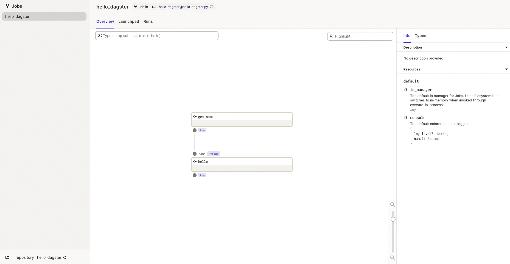

# เริ่มต้นกับ Dagster

## การติดตั้ง Dagster

เราจะใช้ Python environment กัน ซึ่งวิธีนี้เป็นวิธีที่เราจะได้ลองเล่น Dagster ได้ง่ายที่สุด ขอแค่เรามี Python อยู่บนเครื่องเราพอครับ เริ่มต้นเราสร้าง Python virtual environment ก่อนเลย

```sh
python -m venv ENV
source ENV/bin/activate
```

แล้วติดตั้ง Dagster ตามนี้

```sh
pip install dagster
```

เราจะได้ Dagster เวอร์ชั่นล่าสุดมา ถ้าเราอยากจะกำหนดเวอร์ชั่นก็ให้ใช้คำสั่ง

```sh
pip install dagster==0.14.7
```

## ลองสร้าง Simple Data Application

เราอาจจะสร้างไฟล์ขึ้นมาชื่อ `hello_world.py` แล้วเขียนโค้ดตามนี้

```py
from dagster import graph, op


@op
def get_name():
    return "dagster"


@op
def hello(name: str):
    print(f"Hello, {name}!")


@graph
def hello_dagster():
    hello(get_name())
```

การเขียนโค้ด Dagster ขึ้นมาสักไฟล์หนึ่ง จะมีอยู่ 3 คำที่เราต้องรู้ไว้คือ

1. Op จะเป็นหน่วยหนึ่งในการคำนวณ (unit of computation) จะเห็นได้ตามโค้ดด้านบนคือจะมีอยู่ 2 ops ได้แก่ฟังก์ชั่น `get_name` กับ `hello` นั่นเองที่มี decorator `@op` แปะอยู่
1. Graph จะเป็นการเชื่อมต่อ ops เข้าด้วยกัน
1. Job เป็น executable graph ถ้าให้สรุปก็คือ เราสร้าง graph ออกมาก่อน แล้วสร้าง job จาก graph นั้นๆ จะสร้างมากี่ job ก็ได้

ซึ่งตามโค้ดด้านบนเราจะเห็นได้ว่าเราจะมี 1 graph ที่ประกอบไปด้วย 2 ops เชื่อมต่อกัน โดยที่ `get_name` จะถูกรันก่อน แล้วตามด้วย `hello` โดยที่ `hello` รับค่า output จาก `get_name` มาเป็น input

การรัน data application เราสามารถทำได้ 3 วิธี

1. ผ่าน Dagster CLI
1. ผ่าน Dagster Python API
1. ผ่าน Dagit

### รันผ่าน Dagster CLI

ใช้คำสั่งตามนี้ได้เลย

```sh
dagster job execute -f hello_world.py
```

### รันผ่าน Dagster Python API

การจะรันแบบนี้ได้ เราต้องสร้าง job ก่อน จากโค้ดด้านบน เราจะเอา graph มาสร้างเป็น job ได้ตามนี้

```py
job = hello_dagster.to_job()
job.execute_in_process()
```

ที่ graph จะมีเมธอด `to_job` อยู่ พอเราสั่งรันจะได้ job instance ออกมา เสร็จแล้วเราก็จะสั่ง `execute_in_process` ต่อ

เท่านี้เราก็สามารถรันแบบนี้ได้แล้ว

```sh
python hello_world.py
```

จริงๆ แล้วเราสามารถเขียน graph กับ job รวบไปด้วยกันได้นะ โดยใช้ `@job` แทน `@graph` ประมาณนี้

```py
from dagster import job, op


@op
def get_name():
    return "dagster"


@op
def hello(name: str):
    print(f"Hello, {name}!")


@job
def hello_dagster():
    hello(get_name())


hello_dagster.execute_in_process()
```

เราจะได้ job instance มาเลย แล้วเอามาสั่ง `execute_in_process` ต่อได้เลย

### รันผ่าน Dagit

Dagit เป็น web-based interface เอาไว้ส่องดูงานของเราครับ เราต้องติดตั้งเพิ่มก่อน

```sh
pip install dagit
```

แล้วเราค่อยรัน

```sh
dagit -f hello_world.py
```

เราก็จะได้เว็บรันที่ http://localhost:3000 ให้เราเข้าไปเล่นได้ตามรูปด้านล่าง

